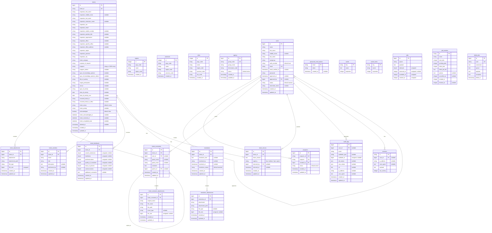

```mermaid
erDiagram
    users {
        bigint id PK
        string name
        string first_name
        string middle_name "nullable"
        string last_name
        string usergroup
        string auth_provider "default local"
        string email UK
        timestamp email_verified_at "nullable"
        string password
        timestamp approved_at "nullable"
        bigint approved_by FK "nullable"
        string status "default inactive"
        string remember_token "nullable"
        timestamp created_at
        timestamp updated_at
    }

    regions {
        integer id PK
        string psgc_code
        string name
        string region_code
        timestamp created_at
    }

    provinces {
        integer id PK
        string psgc_code
        string name
        string region_code
        string province_code
        timestamp created_at
    }

    cities {
        integer id PK
        string psgc_code
        string name
        string region_code
        string province_code
        string city_code
        timestamp created_at
    }

    agency {
        bigint id PK
        string group_code UK
        string group_name
        string directorate_code
        string status "default active"
        timestamp created_at
        timestamp updated_at
    }

    programs {
        bigint id PK
        string program_id UK
        string program UK
        bigint created_by FK
        string status "default active"
        timestamp created_at
        timestamp updated_at
    }

    tickets {
        bigint id PK
        string ticket_id UK
        string requestor_first_name
        string requestor_middle_name "nullable"
        string requestor_last_name
        string requestor_extension_name "nullable"
        string requestor_sex
        string requestor_email
        string requestor_mobile_number "nullable"
        string requestor_position_title "nullable"
        string requestor_organization "nullable"
        string requestor_office "nullable"
        string requestor_specific_office "nullable"
        string requestor_office_address "nullable"
        string requestor_region
        string requestor_province
        string requestor_city
        string ticket_category
        string purpose_of_request
        string program "string or JSON array"
        string program_others "nullable"
        string type_of_knowledge_product "nullable"
        string type_of_knowledge_product_others "nullable"
        string title_of_activity "nullable"
        string target_participants "nullable"
        string venue "nullable"
        string type_of_activity "nullable"
        date date_of_activity "nullable"
        date date_of_activity_end "nullable"
        string received_ticket_to "nullable"
        string received_ticket_to_office "nullable"
        string ticket_status "default review"
        string ticket_priority "nullable"
        boolean acknowledged "default false"
        datetime ticket_acknowledged_at "nullable"
        datetime ticket_resolved_at "nullable"
        datetime ticket_completed_date "nullable"
        timestamp deleted_at "nullable"
        timestamp created_at
        timestamp updated_at
    }

    ticket_attachments {
        bigint id PK
        bigint ticket_id FK
        string attachment
        string attachment_path
        string file_type
        bigint file_size "unsigned"
        timestamp created_at
        timestamp updated_at
    }

    ticket_comments {
        bigint id PK
        bigint ticket_id FK
        bigint user_id FK "nullable"
        string guest_name "nullable"
        string guest_email "nullable"
        text comment
        bigint parent_id FK "nullable"
        timestamp created_at
        timestamp updated_at
    }

    ticket_comment_attachments {
        bigint id PK
        bigint ticket_comment_id FK
        string original_name
        string file_name
        string file_path
        string mime_type "nullable"
        bigint file_size "unsigned, nullable"
        timestamp created_at
        timestamp updated_at
    }

    ticket_activities {
        bigint id PK
        bigint ticket_id FK
        string event
        string title
        text description "nullable"
        string performed_by "nullable"
        timestamp created_at
        timestamp updated_at
    }

    ticket_feedbacks {
        bigint id PK
        bigint ticket_id FK
        tinyint overall_satisfaction "unsigned, nullable"
        tinyint timeliness "unsigned, nullable"
        tinyint professionalism "unsigned, nullable"
        tinyint quality_of_resolution "unsigned, nullable"
        tinyint ease_of_process "unsigned, nullable"
        tinyint communication "unsigned, nullable"
        text additional_comments "nullable"
        timestamp created_at
        timestamp updated_at
    }

    ticket_returns {
        bigint id PK
        bigint ticket_id FK
        text return_reason
        string urgency "low, medium, high, urgent"
        bigint returned_by FK "nullable"
        timestamp returned_at "nullable"
        timestamp created_at
        timestamp updated_at
    }

    resolutions {
        bigint id PK
        bigint ticket_id FK
        text resolution_text "nullable"
        string resolved_by "nullable"
        timestamp resolved_at "nullable"
        string resolution_status "default resolved"
        timestamp created_at
        timestamp updated_at
    }

    resolution_attachments {
        bigint id PK
        bigint resolution_id FK
        string attachment
        string attachment_path
        string file_type "nullable"
        bigint file_size "unsigned, nullable"
        timestamp created_at
        timestamp updated_at
    }

    audit_logs {
        bigint id PK
        bigint user_id FK "nullable"
        string event
        string auditable_type "nullable"
        bigint auditable_id "unsigned, nullable"
        json old_values "nullable"
        json new_values "nullable"
        text url "nullable"
        string ip_address "nullable"
        text user_agent "nullable"
        timestamp created_at
        timestamp updated_at
    }

    users ||--o{ users : approves
    users ||--o{ programs : creates
    users ||--o{ ticket_comments : writes
    users ||--o{ ticket_returns : submits
    users ||--o{ audit_logs : generates

    tickets ||--o{ ticket_attachments : contains
    tickets ||--o{ ticket_comments : receives
    tickets ||--o{ ticket_activities : records
    tickets ||--o{ ticket_feedbacks : receives
    tickets ||--o{ ticket_returns : has
    tickets ||--o{ resolutions : has

    ticket_comments ||--o{ ticket_comments : replies_to
    ticket_comments ||--o{ ticket_comment_attachments : contains
    resolutions ||--o{ resolution_attachments : contains
    password_reset_tokens {
        string email PK
        string token
        timestamp created_at "nullable"
    }

    sessions {
        string id PK
        bigint user_id FK "nullable"
        string ip_address "nullable"
        text user_agent "nullable"
        text payload
        integer last_activity
    }

    cache {
        string key PK
        text value
        integer expiration
    }

    cache_locks {
        string key PK
        string owner
        integer expiration
    }

    jobs {
        bigint id PK
        string queue
        text payload
        tinyint attempts "unsigned"
        integer reserved_at "unsigned, nullable"
        integer available_at "unsigned"
        integer created_at "unsigned"
    }

    job_batches {
        string id PK
        string name
        integer total_jobs
        integer pending_jobs
        integer failed_jobs
        text failed_job_ids
        text options "nullable"
        integer cancelled_at "nullable"
        integer created_at
        integer finished_at "nullable"
    }

    failed_jobs {
        bigint id PK
        string uuid UK
        text connection
        text queue
        text payload
        text exception
        timestamp failed_at
    }

    users ||--o{ sessions : has
```

